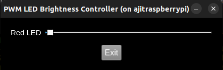

# PWM LED GUI Controller

This GUI application enables dynamic LED brightness control using PWM on a Raspberry Pi.  
It demonstrates both **manual control (Red LED)** and **automated fading behavior (Green & Blue LEDs)** through a clean, Qt-based user interface.

---

## 🔧 Hardware Setup

### Components Required

- Raspberry Pi (with GPIO headers)
- Breadboard
- 3 LEDs (Red, Green, Blue)
- 3 Resistors (220Ω – 330Ω)
- Jumper wires

### GPIO Pin Mapping

| LED Color | GPIO Pin | Physical Pin |
|-----------|----------|--------------|
| Red       | GPIO 17  | Pin 11       |
| Green     | GPIO 27  | Pin 13       |
| Blue      | GPIO 22  | Pin 15       |

### Circuit Instructions

1. Connect the **long leg (anode)** of each LED to a resistor.
2. Connect the other end of each resistor to its respective GPIO pin.
3. Connect the **short leg (cathode)** of all LEDs to the GND rail on the breadboard.
4. Connect the GND rail to the Raspberry Pi’s ground pin (e.g., Pin 6).

---

## 🛠️ Build Instructions

### 1. SSH into your Raspberry Pi (with GUI/X11 support)

```bash
ssh -X pi@<raspberry-pi-ip-address>
```

### 2. Install Required Packages

```bash
sudo apt update
sudo apt install qt5-default qtbase5-dev qtbase5-dev-tools libpigpio-dev
```

### 3. Clone or Transfer This Project to Your Pi

Then navigate into the directory:

```bash
cd task5.2GUI
```

### 4. Build the GUI Application

```bash
qmake
make
```

### 5. Run the Application

```bash
sudo env DISPLAY=$DISPLAY XAUTHORITY=/root/.Xauthority ./task5.2GUI
```

> ✅ Use `sudo` to access GPIO and pass environment variables for X11 display support.

---

## 🧠 How It Works

### Red LED – Manual PWM Control

- Controlled by a GUI slider ranging from 0 to 255.
- Adjusts brightness using PWM (`gpioPWM`), where 255 is full brightness and 0 is off.

### Green & Blue LEDs – Automatic PWM Fading

- A `QTimer` updates every 20 milliseconds.
- A shared `TimerState` variable tracks current brightness and fade direction.
- PWM values are set using:

  ```cpp
  gpioPWM(GREEN_LED, brightness);
  gpioPWM(BLUE_LED, 255 - brightness);
  ```

- This creates a **complementary fade** between the two LEDs.

---

## 🔍 Visual Fading Behavior – What to Expect

- Although the LEDs use complementary PWM values, both can still **appear fully on** to the human eye during much of the cycle.
- This is because:
  - **Human brightness perception is non-linear** — a 50% PWM duty cycle (~128/255) can appear as **70–80% brightness** visually.
  - **LEDs are highly efficient** at lower duty cycles, and even moderate PWM values produce significant visible light.

- As a result, one LED often appears "always on" while the other fades, even though they are smoothly alternating.

## 🔚 Clean Exit

- When the user clicks **Exit**, or the window is closed:
  - All LEDs are turned off.
  - `gpioTerminate()` is called to shut down the pigpio daemon cleanly.

---

## 📷 Output Screenshot


